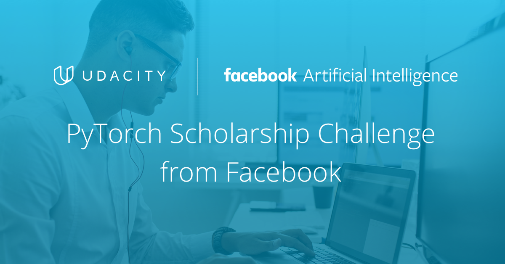

 
<h1>Udacity Deep Learning Nanodegree Program</h1>

&nbsp;&nbsp;&nbsp;&nbsp;

## Background

This repository contains details about [PyTorch Scholarship Challenge from Facebook](https://www.udacity.com/scholarships/facebook-pytorch-scholarship) which helped me to get the Udacity’s [Deep Learning Nanodegree Program](https://www.udacity.com/course/deep-learning-nanodegree--nd101). I have also provided the repositories links and binder links of the projects that had been done under Udacity’s [Deep Learning Nanodegree Program](https://www.udacity.com/course/deep-learning-nanodegree--nd101).

## What is the "PyTorch Scholarship Challenge from Facebook"?

Together with Udacity, Facebook is investing in a scholarship program that will enable students to acquire cutting-edge skills in deep learning using Pytorch, a popular, fast-growing open-source deep learning framework that provides a seamless path from AI research to production deployment. Selected applicants were enrolled in a Foundations Course, which was [Intro to Deep Learning with PyTorch](https://www.udacity.com/course/deep-learning-pytorch--ud188). 100 students went to earn full scholarships for the Udacity’s [Deep Learning Nanodegree Program](https://www.udacity.com/course/deep-learning-nanodegree--nd101).

## How does this scholarship program work?

The scholarship program was structured in two phases:

### Phase 1: Foundations Course

During the first phase of this program, students took Udacity’s [Intro to Deep Learning with PyTorch](https://www.udacity.com/course/deep-learning-pytorch--ud188) course. The duration of this course was two months. Program participants had received support from community managers throughout their learning experience in this course and had been part of a dynamic student community and network of scholars.

### Phase 2: Full Nanodegree Scholarship

The top 100 students from the first phase of the program went to earn a full scholarship to Udacity’s [Deep Learning Nanodegree Program](https://www.udacity.com/course/deep-learning-nanodegree--nd101), where they had cover Convolutional and Recurrent Neural Networks, Generative Adversarial Networks, Deployment, and more. Students had used PyTorch and had access to GPUs to train models faster, as they learn from authorities like Sebastian Thrun, Ian Goodfellow, Jun-Yan Zhu, and Andrew Trask.

## Projects Completed in Udacity’s Deep Learning Nanodegree Program:

- [Predicting Bike-Sharing Patterns](https://github.com/iamrajiv/Predicting-Bike-Sharing-Patterns)&nbsp;
- [Dog-Breed Classifier](https://github.com/iamrajiv/Dog-Breed-Classifier)&nbsp;
- [Generate TV Scripts](https://github.com/iamrajiv/Generate-TV-Scripts)&nbsp;
- [Generate Faces](https://github.com/iamrajiv/Generate-Faces)&nbsp;
- [Deploying a Sentiment Analysis Model](https://github.com/iamrajiv/Deploying-a-Sentiment-Analysis-Model)&nbsp;

## Udacity’s Deep Learning Nanodegree Program Completion Certificate

[Udacity’s Deep Learning Nanodegree Program Completion Certificate](https://graduation.udacity.com/confirm/5GDJ9MFC)

## License

[MIT](https://github.com/iamrajiv/Udacity-Deep-Learning-Nanodegree-Program/blob/master/LICENSE)
